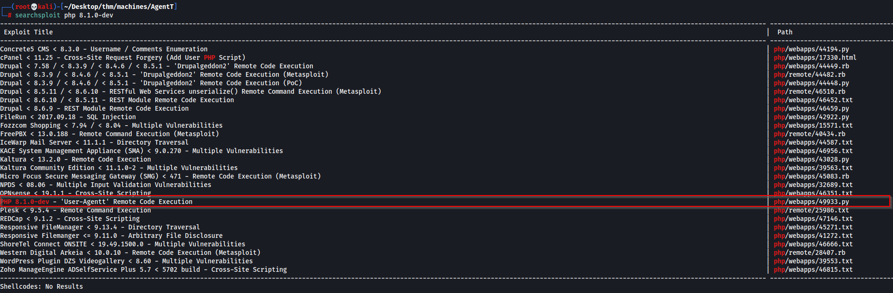
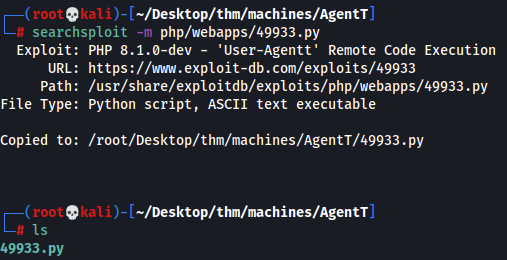
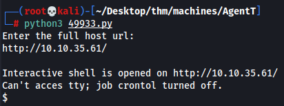
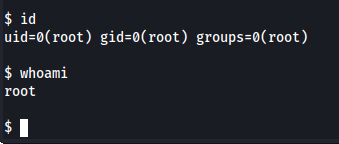
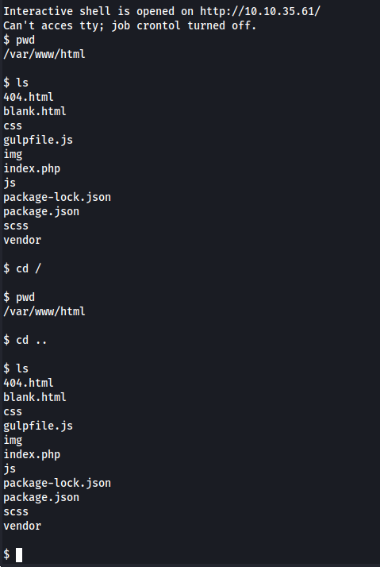
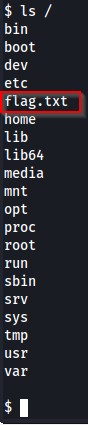
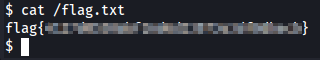

# Agent T

## Overview

### This is a short writeup showing how we got in [Agent T](https://tryhackme.com/room/agentt) machine from [TryHackMe](https://tryhackme.com/).

## Enumeration

### Lets start with a port scan. I am using nmap.

```nmap
Starting Nmap 7.92 ( https://nmap.org ) at 2022-09-20 13:29 EDT
Nmap scan report for 10.10.35.61
Host is up (0.069s latency).
Not shown: 65534 closed tcp ports (reset)
PORT   STATE SERVICE VERSION
80/tcp open  http    PHP cli server 5.5 or later (PHP 8.1.0-dev)
|_http-title:  Admin Dashboard
No exact OS matches for host (If you know what OS is running on it, see https://nmap.org/submit/ ).
TCP/IP fingerprint:
OS:SCAN(V=7.92%E=4%D=9/20%OT=80%CT=1%CU=34646%PV=Y%DS=2%DC=T%G=Y%TM=6329F8D
OS:9%P=x86_64-pc-linux-gnu)SEQ(SP=103%GCD=1%ISR=106%TI=Z%CI=Z%II=I%TS=A)OPS
OS:(O1=M508ST11NW6%O2=M508ST11NW6%O3=M508NNT11NW6%O4=M508ST11NW6%O5=M508ST1
OS:1NW6%O6=M508ST11)WIN(W1=FE88%W2=FE88%W3=FE88%W4=FE88%W5=FE88%W6=FE88)ECN
OS:(R=Y%DF=Y%T=3F%W=FAF0%O=M508NNSNW6%CC=Y%Q=)T1(R=Y%DF=Y%T=3F%S=O%A=S+%F=A
OS:S%RD=0%Q=)T2(R=N)T3(R=N)T4(R=Y%DF=Y%T=3F%W=0%S=A%A=Z%F=R%O=%RD=0%Q=)T5(R
OS:=Y%DF=Y%T=40%W=0%S=Z%A=S+%F=AR%O=%RD=0%Q=)T6(R=Y%DF=Y%T=40%W=0%S=A%A=Z%F
OS:=R%O=%RD=0%Q=)T7(R=Y%DF=Y%T=40%W=0%S=Z%A=S+%F=AR%O=%RD=0%Q=)U1(R=Y%DF=N%
OS:T=40%IPL=164%UN=0%RIPL=G%RID=G%RIPCK=G%RUCK=G%RUD=G)IE(R=Y%DFI=N%T=40%CD
OS:=S)

Network Distance: 2 hops

TRACEROUTE (using port 80/tcp)
HOP RTT      ADDRESS
1   67.84 ms 10.8.0.1
2   68.41 ms 10.10.35.61

OS and Service detection performed. Please report any incorrect results at https://nmap.org/submit/ .
Nmap done: 1 IP address (1 host up) scanned in 95.05 seconds
```

### We can see port 80 open and running http. Lets give the website a visit.


### First thing that caught my eye was that we are logged in as the admin user. But after clicking around the website for a few minutes, I did not find anything there. 

### The next thing that came to my mind was to check the version of the http service for any exploits. We can see its the __PHP 8.1.0-dev__ version from our nmap scan. 

### Lets run a searchsploit scan to see if there are any known expolits on this version.



### This looks very promising. Remote Code Execution on our exact version. Lets give it a go.

## Exploitation

### First lets copy the exploit in the current directory.



### We can see it is a python script. Lets run it with __python3__.



### And there we go. After supplying the full url we got a shell. Lets see what user we landed on.



### Would you look at that. Seems like we are root right away. Lets try to move around and find the flag.



### Looks like we are in _/var/www/html_. But this shell is not letting us change directory. So lets start looking from the root direcotry and list files until we find our flag.



### Seems like we have found our flag file in the root directory.


